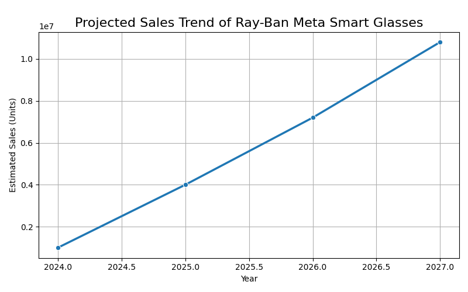

# Visualizations

This folder contains all visual representation files generated from the cleaned data for the Ray-Ban Meta smart glasses project.

## Purpose

- To provide graphical insights into sales trends, growth patterns, and market share distribution.
- To support the analysis through clear and informative charts and graphs.
- To facilitate communication of data-driven findings to stakeholders.

## Contents

- **Line_Chart/**: Line charts illustrating sales trends over time.
- **Bar_Chart/**: Bar charts showing year-over-year (YoY) growth percentages.
- **Pie_Chart/**: Pie charts depicting market share breakdown among competitors.
- **README.md**: This document describing the folder's purpose and structure.

## Notes

- All visualization files are saved in PNG format.
- File naming conventions follow the chart type and content for easy identification.
- Visualizations are generated using Python libraries such as Matplotlib and Seaborn.

---

## 1️⃣ YoY Sales Growth (Bar Chart)

  
[🔗 View Full Size](Bar_Chart/yoy_growth.png)

## 2️⃣ Market Share Breakdown (Pie Chart)

  
[🔗 View Full Size](Pie_Chart/market_share.png)

## 3️⃣ Sales Trend Over Time (Line Chart)

  
[🔗 View Full Size](Line_Chart/sales_trend.png)

---

Keeping the visualizations well-organized ensures effective presentation and easier updates for future analyses.
